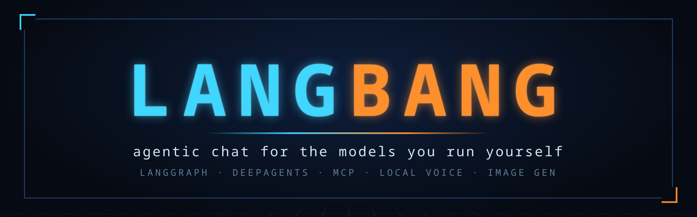
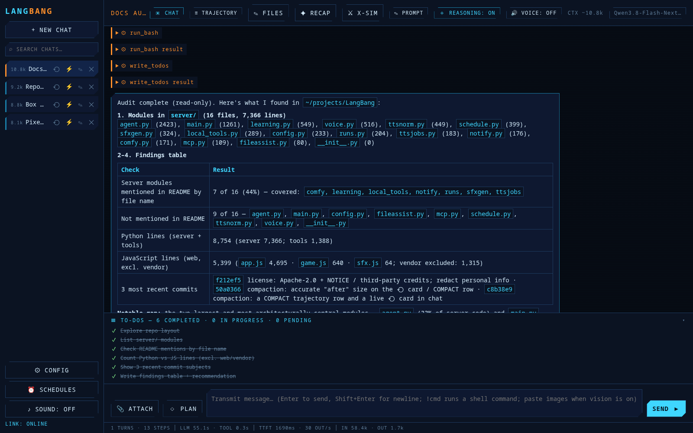
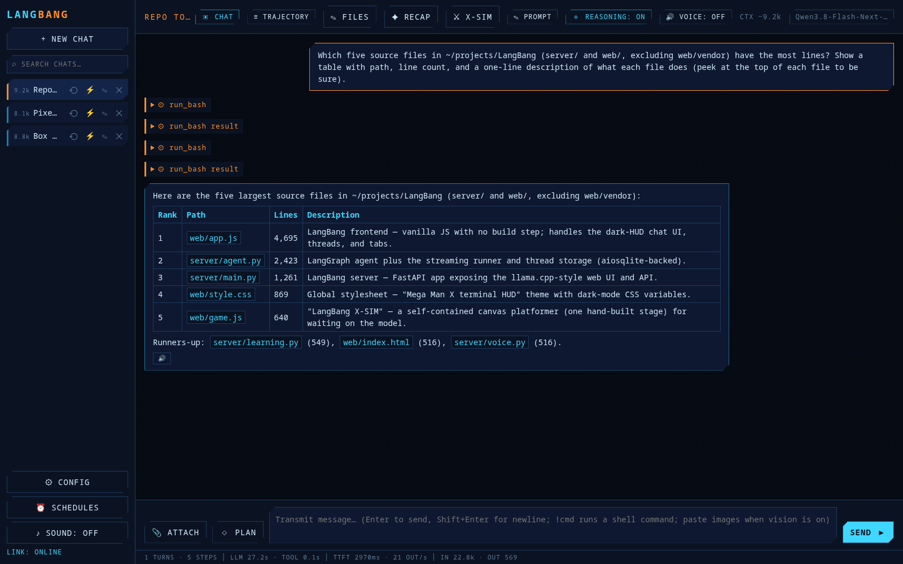
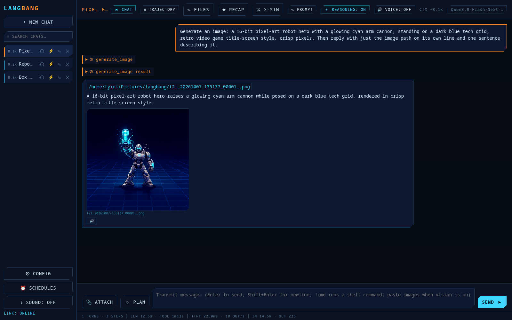
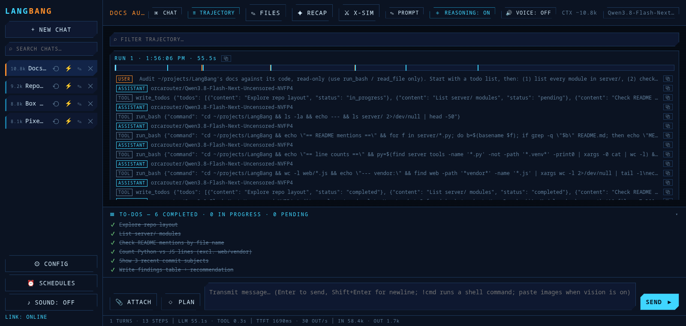
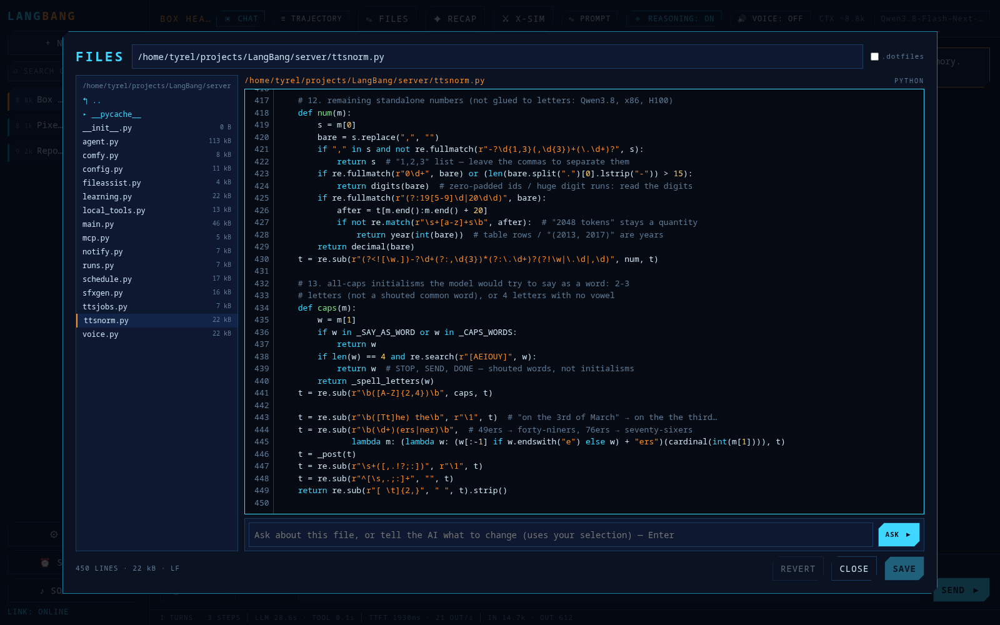
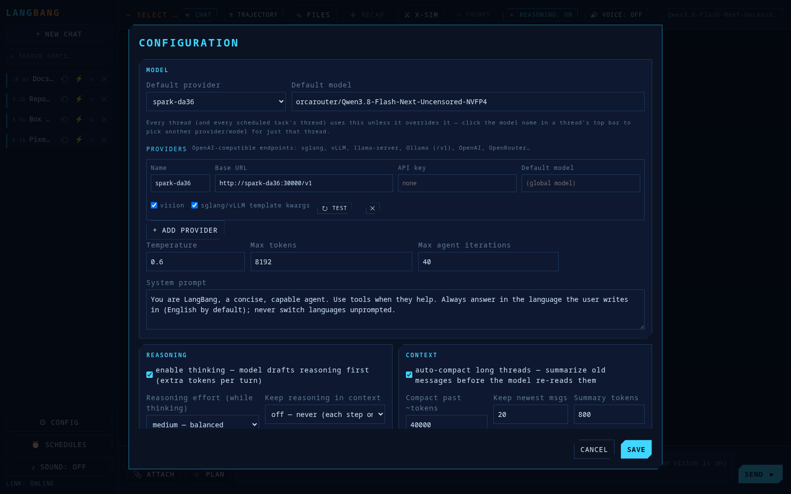
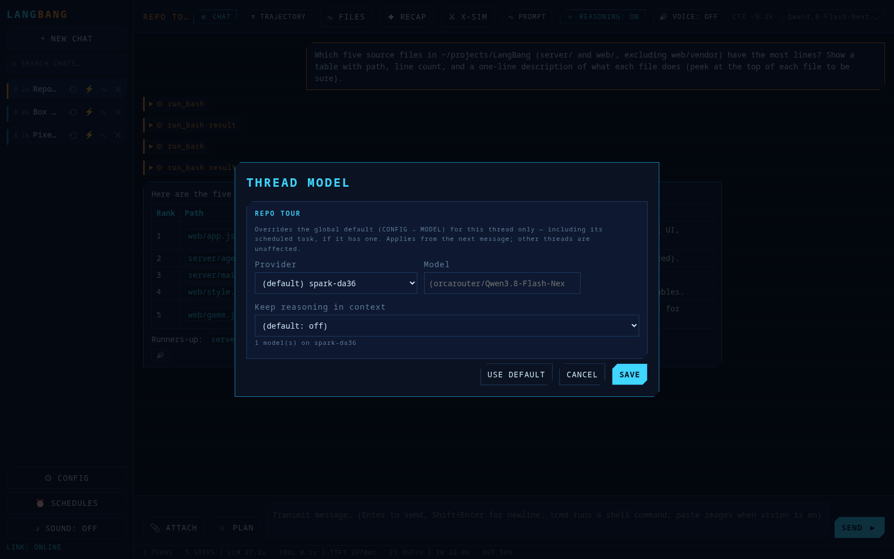
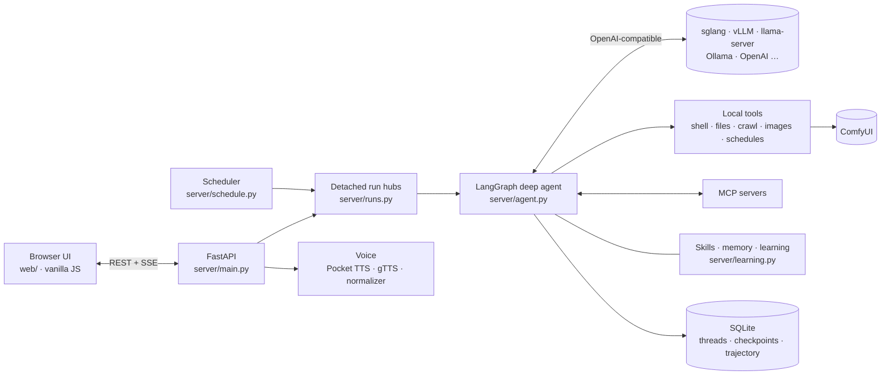

<p align="center">
  
</p>

<p align="center">
  <b>A self-hosted agent workspace for your own LLM servers</b><br>
  LangGraph deep agents · MCP tools · scheduled tasks · local voice · image generation — in a llama.cpp-style web UI
</p>

<p align="center">
  <a href="LICENSE"></a>
  
  
  
  
  
</p>

<p align="center">
  <a href="#quick-start">Quick start</a> ·
  <a href="#features">Features</a> ·
  <a href="#screenshots">Screenshots</a> ·
  <a href="#architecture">Architecture</a> ·
  <a href="docs/FEATURES.md">Full feature notes</a> ·
  <a href="#security">Security</a>
</p>

> [!WARNING]
> **Read [Security](#security) before running this.** The agent gets an
> **unsandboxed shell and full file access** on the host, with no approval prompt
> and no authentication. It's built as a personal tool for a trusted LAN/tailnet —
> never expose it to the internet.

<p align="center">
  
</p>

## About

LangBang is what you get if llama.cpp's built-in web UI grew an agent: point it
at any OpenAI-compatible server — **sglang, vLLM, llama-server, Ollama, OpenAI,
OpenRouter** — and you get a persistent, multi-thread chat where the model can
plan with a todo list, run shell commands, read and edit files, call MCP tools,
generate images, read its answers aloud, and keep working on a schedule while
you're away.

It's a single Python process (FastAPI + LangGraph) with a no-build vanilla-JS
frontend in a dark "terminal HUD" theme. Everything stateful lives in SQLite and
plain files under `data/`. It was built for a home lab of NVIDIA DGX Sparks
running Qwen3.8, and every rough edge it hit along the way — long-context
blowups, mangled tool calls, stuck scheduled runs — is documented in the
[feature notes](docs/FEATURES.md).

## Features

**Agent**
- **Deep agent** ([deepagents](https://github.com/langchain-ai/deepagents)) on LangGraph: `write_todos` planning, sub-agent delegation, file tools, shell, web crawl — with a live to-do panel
- **Plan mode + human gates** — the agent asks you structured questions (`ask_user`) and, in plan mode, investigates read-only and waits for you to approve the plan
- **MCP servers** (stdio / SSE / streamable-HTTP) managed in the UI — test connection, enable/park, import from Claude Desktop configs
- **Skills** ([Agent Skills](https://agentskills.io) spec) — the agent writes and improves its own skills, and can read your existing Hermes skill tree
- **Memory + learning loop** — durable memories across threads, and a post-run review that turns hard-won procedures into skills
- **Robust on local models** — repairs mangled tool-call args, keeps the final answer honest about its todo list, survives MCP servers dying mid-call

**Models & context**
- **Providers + per-thread override** — configure several backends, pick a global default, override provider/model per thread (or per scheduled task)
- **Reasoning** — thinking on/off, reasoning effort, and optionally keep reasoning in context across tool steps
- **Context auto-compaction** anchored on the backend's real token counts — long agentic runs fold their history instead of hitting the context wall
- **Trajectory view** — every model call, tool call, compaction and error with timings and token counts, copyable as text

**Workspace**
- **Scheduled tasks** — cron or one-off; runs are server-owned, so they keep going with no tab open
- **Notifications** — in-app toasts, desktop popups, and phone push via [ntfy](https://ntfy.sh) (self-hostable)
- **✎ FILES** — browse and edit any file with syntax highlighting, Markdown preview, media viewer, and an AI edit bar scoped to that file
- **Image generation & editing** — Qwen-Image via ComfyUI; results render inline
- **Voice** — read-aloud with local streaming [Pocket TTS](https://github.com/kyutai-labs/pocket-tts) (CPU, voice cloning) or gTTS / Google Cloud, with a text normalizer so dates, times, money and tables are spoken correctly
- **Per-thread prompts**, chat search, recap, inline media for any cited file path, and a hidden X-SIM platformer for waiting on slow models

See **[docs/FEATURES.md](docs/FEATURES.md)** for the full reference.

## Screenshots

| | |
|:---:|:---:|
| <br>**Chat** — tool calls fold into cards, answers render as Markdown | <br>**Image generation** — cited files render inline |
| <br>**Trajectory** — every step with timing and tokens | <br>**✎ FILES** — editor with highlighting and an AI edit bar |
| <br>**Providers** — any OpenAI-compatible backend | <br>**Per-thread model** — override provider, model and reasoning per thread |

## Quick start

**Requirements:** Python 3.12+, [uv](https://docs.astral.sh/uv/), and an
OpenAI-compatible chat endpoint serving a tool-calling model. Optional:
`ffmpeg` (streaming Pocket TTS), a ComfyUI server (image generation), a
Hugging Face login with Kyutai's terms accepted (Pocket TTS weights are gated).

```bash
git clone https://github.com/TyrelCB/langbang.git
cd langbang
uv sync                                   # installs deps (CPU-only PyTorch for Pocket TTS)

# point it at your backend for the first run (or configure later in the UI)
export LANGBANG_BASE_URL=http://localhost:8000/v1
export LANGBANG_MODEL=your-model-name
export LANGBANG_API_KEY=none              # or a real key for hosted APIs

uv run uvicorn server.main:app --host 127.0.0.1 --port 8123
```

Open <http://localhost:8123>, then **⚙ CONFIG → MODEL** to add more providers,
pick defaults, and enable the features you want. Use `--host 0.0.0.0` only on a
network you trust (see [Security](#security)).

| Environment variable | Purpose |
|---|---|
| `LANGBANG_BASE_URL`, `LANGBANG_MODEL`, `LANGBANG_API_KEY` | first-run default provider (afterwards: CONFIG) |
| `LANGBANG_DATA_DIR` | where settings, threads, trajectory, uploads and TTS cache live (default `./data`) |
| `LANGBANG_CRAWL4AI_URL`, `LANGBANG_CRAWL_TIMEOUT` | [crawl4ai](https://github.com/unclecode/crawl4ai) service behind the `crawl_url` tool |
| `LANGBANG_RAG_MCP_URL` | optional RAG MCP server registered by default |
| `LANGBANG_HERMES_SKILLS` | an existing skill tree to load read-only (default `~/.hermes/skills`) |
| `LANGCHAIN_API_KEY` + `LANGCHAIN_TRACING_V2=true` | LangSmith tracing |

> The built-in defaults (backend, ComfyUI, crawl4ai, MCP URLs) point at the
> author's lab hosts — override them with the variables above or in CONFIG.

## Architecture



Runs belong to the server, not the browser tab: a dropped connection, a reload
or a closed laptop never cancels work — only ■ STOP does. Tabs re-attach to a
live run and replay what they missed.

| Module | Role |
|---|---|
| `server/main.py` | FastAPI app: chat/stream, threads, files, voice, images, schedules, settings |
| `server/agent.py` | agent construction, middleware (gates, compaction, todo reconcile, tool-arg repair), streaming runner, thread storage |
| `server/runs.py` | detached run hubs with replayable event streams |
| `server/schedule.py` | cron + one-off scheduled tasks |
| `server/config.py` | settings, providers, per-run resolution |
| `server/learning.py` | per-thread prompts, memory, post-run skill/memory review |
| `server/mcp.py` | MCP client with per-server timeouts and isolation |
| `server/local_tools.py` | shell, files, crawl, image generation, scheduling tools |
| `server/voice.py`, `server/ttsjobs.py`, `server/ttsnorm.py` | TTS providers, streaming jobs, text normalization |
| `server/comfy.py` | ComfyUI workflow builder (Qwen-Image text-to-image + edit) |
| `server/notify.py` | toasts / desktop / ntfy push |
| `server/fileassist.py`, `server/sfxgen.py` | FILES AI edit bar; UI sound-effect regeneration |
| `web/` | `index.html`, `app.js`, `style.css`, `game.js` (X-SIM), `sfx.js`, vendored JS, sounds |
| `tools/` | A/B harness, sglang parser patch, TTS normalizer checks, demo MCP server |

## Security

The built-in tools give the agent **unsandboxed shell and file access on the
machine running the server** (`run_bash` = `bash -lc`). There is no approval
prompt and no login — by design, this is a personal LAN tool.

- **Never expose it to the internet.** Bind to `127.0.0.1`, or to a LAN/tailnet
  you fully trust. Don't put an auth-bypassing proxy in front of it.
- Anyone who can reach `/api/chat` or `/api/shell` (the `!cmd` route) can run
  commands as you. `GET /api/media?path=` serves any absolute path for the
  inline players — the same read access the shell already grants.
- MCP servers you add run with your privileges too (stdio servers are spawned
  as local processes).

## Docs

- [docs/FEATURES.md](docs/FEATURES.md) — full feature reference and design notes
- [SOUND_DESIGN.md](SOUND_DESIGN.md) — the UI sound pack and how it's generated
- [tools/sglang-patches/](tools/sglang-patches/) — a parser fix for tag-less single-parameter tool calls
- [tools/ab/](tools/ab/) — A/B harness (keep-reasoning-in-context experiment)

## License & credits

LangBang is licensed under the [Apache License 2.0](LICENSE). See
[NOTICE](NOTICE) for attributions and
[THIRD_PARTY_NOTICES.md](THIRD_PARTY_NOTICES.md) for bundled third-party code.

Built on [LangChain](https://github.com/langchain-ai/langchain),
[LangGraph](https://github.com/langchain-ai/langgraph) and
[deepagents](https://github.com/langchain-ai/deepagents) (MIT), served by
[FastAPI](https://github.com/fastapi/fastapi) — installed as dependencies, not
redistributed. Text-to-speech uses [Pocket TTS](https://github.com/kyutai-labs/pocket-tts)
by Kyutai (code MIT; model weights CC-BY-4.0, gated on Hugging Face and
downloaded by each user — not included here). The UI sound effects in
`web/sounds/` were generated with Stability AI's Stable Audio 3 small-sfx
model — **Powered by Stability AI**. `tools/sglang-patches/` contains files
derived from [SGLang](https://github.com/sgl-project/sglang) (Apache-2.0).
Screenshot content was generated by LangBang itself (Qwen3.8 for the chats,
Qwen-Image 2.1 via ComfyUI for the pixel-art image).
